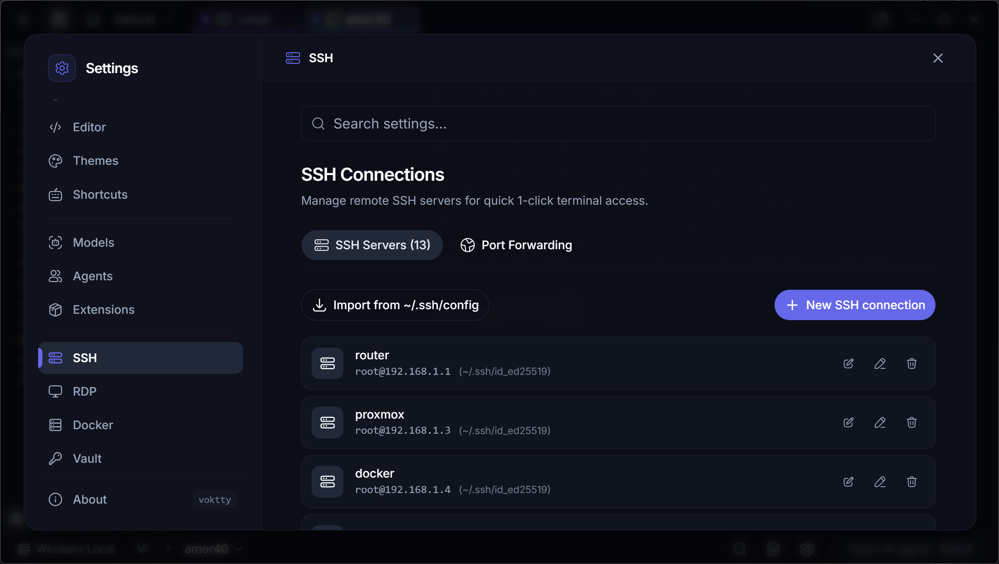
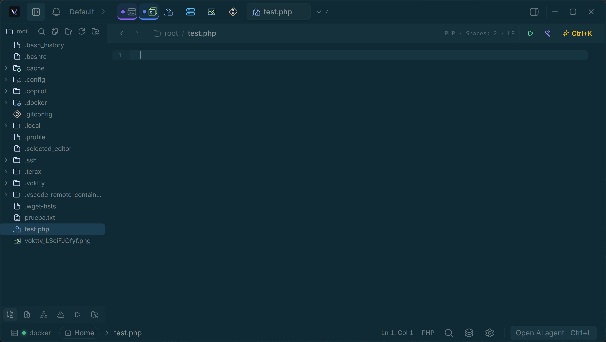
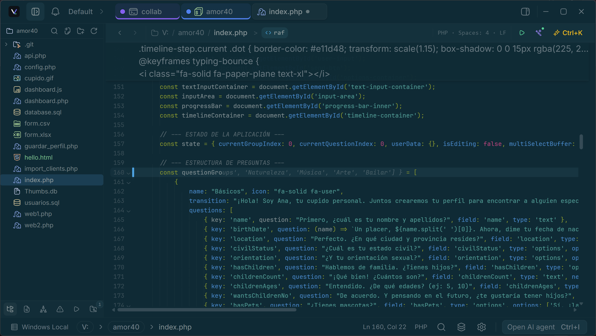
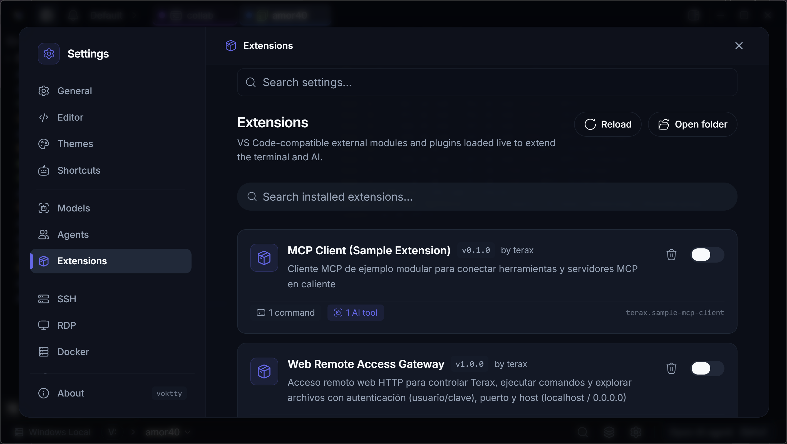

<div align="center">
  
  <h1>Voktty</h1>

  <p><strong>Lightweight Terminal-first AI-native dev workspace.</strong></p>
  <p>
    <a href="https://voktty.dev">Website</a>
    ·
    <a href="https://voktty.dev/docs">Docs</a>
    ·
    <a href="https://github.com/voktty/voktty">Source code</a>
  </p>

  <p>
    
    
    
    <a href="https://discord.gg/z8mzebCzJB"></a>
  </p>
</div>

<p align="center">
  <a href="docs/readme/README.zh-CN.md">简体中文</a> |
  <a href="docs/readme/README.es.md">Español</a> |
  <a href="docs/readme/README.de.md">Deutsch</a> |
  <a href="docs/readme/README.fr.md">Français</a> |
  <a href="docs/readme/README.ja.md">日本語</a> |
  <a href="docs/readme/README.ko.md">한국어</a> |
  <a href="docs/readme/README.pt-BR.md">Português</a> |
  <a href="docs/readme/README.pl.md">Polski</a> |
  <a href="docs/readme/README.ru.md">Русский</a> |
  <a href="docs/readme/README.id.md">Bahasa Indonesia</a> |
  <a href="docs/readme/README.hi.md">हिन्दी</a>
</p>

---

Voktty is a lightweight open-source terminal-first AI-native development environment (ADE) built on Tauri 2, Rust, and React 19. It combines a native PTY and WebGL terminal, an IDE workbench, AI agents, Git, remote environments, infrastructure controls, and collaboration in one desktop app. About 7-8 MB on disk. No telemetry. No account.

## Screenshots

The current product captures are maintained in [`docs/images`](docs/images/README.md) and grouped by feature in the [official screenshot gallery](docs/screenshots.md).

<table>
  <tr>
    <td align="center"><br/><sub>Remote workspace, tabs, and file explorer</sub></td>
    <td align="center"><br/><sub>Saved SSH connections and port forwarding</sub></td>
  </tr>
  <tr>
    <td align="center"><br/><sub>Editor workspace with a PHP file</sub></td>
    <td align="center"><br/><sub>Source control and Git commit graph</sub></td>
  </tr>
  <tr>
    <td align="center"><br/><sub>Theme presets and personalization</sub></td>
    <td align="center"><br/><sub>Natural-language terminal Copilot</sub></td>
  </tr>
  <tr>
    <td align="center"><br/><sub>Code editor and language-aware status</sub></td>
    <td align="center"><br/><sub>Extensions, commands, and AI tools</sub></td>
  </tr>
  <tr>
    <td colspan="2" align="center"><br/><sub>Terminal, system information, tabs, and workspace explorer</sub></td>
  </tr>
</table>

## Features

### Terminal and workspace

- **Raw and block terminal modes:** Switch a live PTY between a conventional xterm.js surface and command-aware blocks without restarting the shell or losing foreground processes.
- **Native shells and shell integration:** PowerShell 7, Windows PowerShell, Command Prompt, Bash, Zsh, and Fish, with native cwd, prompt-boundary, command, and exit-code tracking through OSC 7 and OSC 133.
- **Fast rendering with bounded resources:** WebGL rendering, searchable scrollback, interactive links, and a renderer pool that keeps active jobs alive while idle hidden panes release expensive rendering resources.
- **Terminal AI:** Generate context-aware commands with the inline Copilot, enter natural-language tasks from the terminal input, preview before execution, and explain or fix failed command blocks.
- **Smart command entry:** History-based ghost suggestions, full or word-by-word acceptance, multiline editor-like input, and a per-tab authorization option for generated commands.
- **Project scripts:** Detect and run scripts from `package.json`, `Cargo.toml`, `Makefile`, Compose files, `pyproject.toml`, and Go projects.
- **Private terminals:** Open a terminal whose buffer and live context are unavailable to Voktty AI tools and agent process tracking.
- **Tabs, panes, and spaces:** Horizontal or vertical tab bars, tab search, locking and colors, up to eight split panes with keyboard navigation and swapping, plus persistent flat visual spaces configurable for 2, 4, 6, or 8 views.
- **Flat composite spaces:** Keep standalone tabs separate from named spaces, reorder members deterministically, dismantle a space without destroying its tabs, and prevent nested spaces or unlimited pane matryoshkas.
- **Desktop drag and drop:** Insert files from the explorer or operating system into a terminal as shell-safe paths.

### Editor and IDE workbench

- **CodeMirror 6 editor:** Lazy language support for TypeScript and JavaScript, Rust, Python, Go, C and C++, Java, PHP, Vue, Svelte, HTML, CSS, JSON, Markdown, shell files, and more.
- **Quick Open (`Ctrl+P` / `Cmd+P`):** Fuzzy file discovery with workspace-scoped recent files across local, WSL, and SSH projects. Files open as preview tabs until pinned.
- **Workspace search and replace (`Ctrl+Shift+F` / `Cmd+Shift+F`):** Persistent search with regex, case, whole-word, include and exclude globs, ignore-file support, exact result navigation, and preview-first transactional replacement across local, WSL, and SSH workspaces.
- **Workbench navigation:** Independent Back and Forward history across files and spaces, go to line, content search, a configurable `F1` command palette, and a separate active-tab launchpad.
- **Outline and symbols:** Document symbols from LSP with a bounded local fallback for common languages, plus workspace symbols when the active language server supports them.
- **Problems panel:** Workspace diagnostics grouped by file, with severity and text filters, exact navigation, bounded storage, and live cleanup when language-server sessions end.
- **Opt-in LSP:** Diagnostics, completion, formatting, code actions, definitions, references, document and workspace symbols, semantic presentation, installation hints, and custom stdio servers. Sessions are scoped to a workspace root, reference-counted, crash-aware, and bounded; no language server starts until enabled.
- **Run and Debug:** Launch local or WSL debug sessions through the Debug Adapter Protocol when a supported adapter is configured, with explicit transport and capability feedback.
- **AI-assisted editing:** Low-latency inline completion with multiline ghosts, local-model support, selection-based Ask and Edit actions, and reversible side-by-side AI diffs with per-hunk acceptance.
- **Explicit model roles:** Choose one configured chat model for reasoning and editing, and a separate autocomplete model for low-latency ghosts. Both roles work with supported cloud providers, OpenAI-compatible endpoints, and local runtimes.
- **Safe file handling:** External-change conflict detection, original line-ending and indentation preservation, configurable format-on-save tools, large-file safeguards, and a live diff gutter.
- **Editing extras:** In-file find and replace with regex, Vim mode, GFM Markdown with task checkboxes and links, rendered Markdown, media and PDF previews, breadcrumbs, and line, column, language, indent, and EOL status.
- **Independent editor themes:** Follow the application theme automatically or choose a dedicated CodeMirror theme such as Kanagawa, Catppuccin, Rosé Pine, Everforest, Dracula, Solarized, Nord, Tokyo Night, GitHub, or Xcode.

### Files, Git, and previews

- **File explorer:** Material and Catppuccin icons, fuzzy filtering, keyboard navigation, hidden-file control, create, rename, copy, delete, context actions, and live filesystem updates.
- **Source control:** Repository discovery and initialization, flat or tree views, stage or unstage files and all changes, reviewed discard actions, commit, fetch, fast-forward pull, and upstream-aware push.
- **AI semantic staging:** Group changed files into logical Conventional Commits and generate concise commit subjects in the configured language.
- **Branches and worktrees:** Current branch and detached HEAD status, branch checkout, ahead and behind state, divergence handling, and linked worktree navigation.
- **Git history:** Searchable commit history with merge and branch lanes, refs, changed-file lists, per-commit diffs, and remote commit links.
- **Web preview:** Detect local development servers, manage background preview servers, and open local or external URLs in native child webviews.
- **Media tabs:** View images, video, audio, PDFs, and Markdown without leaving the workspace.

### Remote systems and infrastructure

- **First-class environments:** Local shells, installed WSL distributions, SSH hosts, and Docker containers can own terminals and workspace context.
- **SSH workspaces:** Saved connections, OpenSSH config import, identity-file or encrypted-vault keys, initial remote directories, remote file browsing and editing, uploads and downloads, latency checks, and CPU, memory, disk, network, load, and session metrics.
- **SSH tunnels:** Visual local (`-L`), remote (`-R`), and dynamic SOCKS5 (`-D`) forwarding with saved profiles and live start, stop, and status controls.
- **Docker dashboard:** Daemon status, searchable container inventory, CPU and memory statistics, port and Compose metadata, logs, start, stop, restart, and terminal access inside running containers.
- **Serial terminal:** COM and TTY connections with baud rate, data bits, parity, stop bits, flow control, DTR and RTS signals, and reset pulse support.
- **Remote desktop:** Saved RDP profiles, host probing, embedded sessions where supported, and native-client launch support.
- **Consistent connection lifecycle:** Local, WSL, SSH, Docker, and serial environments expose resolving, connecting, ready, reconnecting, failed, and disconnected states without allowing stale attempts to replace a newer connection.

### AI and coding agents

- **Bring your own model:** OpenAI, Anthropic, Google Gemini, xAI, Cerebras, Groq, DeepSeek, Mistral, OpenRouter, and arbitrary OpenAI-compatible endpoints.
- **Local inference:** LM Studio, MLX, and Ollama can power chat, agent work, or editor autocomplete without a cloud model.
- **Persistent conversations:** Named sessions in the docked panel or mini window, model selection, reasoning controls, reusable `#handle` prompt snippets, text, image and selection attachments, and voice input.
- **Approval-gated tools:** Read and search project files, propose writes, create or rename files, run foreground or background commands, maintain task lists, and delegate bounded work to custom sub-agents.
- **Reviewable edits:** Proposed file mutations open as diffs and require explicit acceptance before writing.
- **Plan mode and custom agents:** Confirm multi-step execution plans and define agents with their own instructions and tool subsets.
- **MCP client:** Connect optional local stdio or remote Streamable HTTP servers. Rust owns transport, OAuth, schemas, validation, cancellation, audit, and one-use approval grants; each AI run receives an immutable tool snapshot and remote descriptions/results stay marked as untrusted data.
- **Terminal coding-agent launcher:** Start one to four balanced panes for Claude Code, Codex, Gemini CLI, Pi, OpenCode, or Grok with customizable launch commands.
- **Agent supervision:** Track working, waiting, finished, and failed states; receive in-app or operating-system notifications; review changed-file summaries; and jump directly to the agent that needs attention.

### Encrypted terminal collaboration

- **Temporary sharing without a Voktty account:** Publish a host-owned terminal through an external Cloudflare Quick Tunnel and invite up to seven guests with a separate URL and short-lived code.
- **End-to-end protected sessions:** HMAC-authenticated joins and directional AES-256-GCM encryption for terminal and control payloads, in addition to the tunnel's TLS transport.
- **Host-controlled roles:** Every guest starts as an observer. The host can grant or revoke the single controller role, remove participants, or stop the session immediately.
- **Resilient terminal state:** Bounded snapshots and sequenced replay keep the shared terminal consistent across joins and transient reconnects without silently dropping output.
- **Optional remote citations:** The host can authorize read-only `@` file search and text citations inside one workspace. Writes, secret paths, binary files, and paths outside that root remain blocked.

### Customization, extensions, and desktop integration

- **Application themes:** Bundled light and dark themes, validated custom theme files, live theme editing, import and sharing, plus per-theme terminal palettes and typography.
- **Background and window effects:** Background images with opacity and blur controls, plus native transparent Mica or vibrancy chrome where the operating system supports it.
- **Personalized UI:** Terminal font family, weight and size, editor font size, cursor and scrollback settings, horizontal or vertical tabs, zoom, Zen mode, searchable settings, and fully editable keyboard shortcuts.
- **Multilingual interface:** English, Spanish, Portuguese, French, German, Italian, Simplified Chinese, Japanese, Korean, and Russian.
- **Configuration backup:** Export, copy, validate, and import preferences, SSH profiles, and tunnel definitions while excluding passwords, keys, and other sensitive fields.
- **Native extension runtime:** Load JavaScript extensions from `~/.voktty/extensions/`, enable or disable them without restarting, and contribute commands, keybindings, AI tools, notifications, shell execution, and workspace-aware behavior. This is a Voktty API, not VS Code extension compatibility.
- **Agent presence and local feedback:** Optional offline UI sounds cover navigation, saves, Git, Problems, tasks, debugging, and agent responses. Built-in role avatars and animated external-agent tab icons reflect activity while respecting reduced-motion and visibility settings.
- **Desktop lifecycle:** Automatic updates, optional launch at login, system tray controls, restored window state, and native notifications.
- **Local `voktty` command:** From a Voktty terminal, open an authorized workspace file at a line and query the running app's identity and capabilities.

### Privacy and security

- **No account and no Voktty telemetry:** Voktty runs no first-party telemetry service. Enabled AI features communicate only with the cloud or local provider you select.
- **Protected credentials:** AI provider keys use the operating-system keychain. The optional encrypted vault stores SSH keys, passphrases, API keys, tokens, and generic secrets with a master password and automatic locking.
- **Workspace boundaries:** Native filesystem access is authorized per workspace, and local control requests can open only regular files inside an authorized root.
- **Secret and endpoint safeguards:** AI file tools reject sensitive paths, mutating tools require approval, and local or compatible model endpoints are used only after you configure them.

## Install

Latest installers are on the [Releases](https://github.com/voktty/voktty/releases/latest) page. Voktty auto-updates from there.

### Windows notes

- Default shell detection: `pwsh.exe` (PowerShell 7+) -> `powershell.exe` (Windows PowerShell 5.1) -> `cmd.exe`.
- WSL is a first-class workspace environment, not a wrapped subprocess.

### Linux notes

- **Arch / AUR:** `yay -S voktty-bin` (or `paru`, etc.). Tracks the latest release.
- **NixOS / Nix**: use the official flake - `nix profile install github:voktty/voktty` (non-NixOS), or import the flake and add `inputs.voktty.packages.${pkgs.system}.voktty` to `environment.systemPackages` (NixOS). The `nixosModules.voktty` output is also available for a simpler setup.
- **AppImage:** needs FUSE. Without it: `./Voktty_*.AppImage --appimage-extract-and-run`. On Wayland with rendering glitches, try `WEBKIT_DISABLE_DMABUF_RENDERER=1`. Otherwise the `.deb` / `.rpm` packages link against the system GTK stack and tend to be smoother.

## Configure AI

1. Open **Settings -> AI**.
2. Pick a provider and paste your API key. For local inference, point Voktty at your LM Studio / MLX / Ollama endpoint.
3. Keys are written to the OS keychain via `keyring`. They never touch disk or localStorage.

## Build from source

**Prerequisites**
- Rust (stable), https://rustup.rs
- Node 22+ and [pnpm](https://pnpm.io)
- Tauri prerequisites for your platform, https://tauri.app/start/prerequisites/

**Run**
```bash
pnpm install
pnpm tauri dev          # development
pnpm tauri build        # production bundle
```

**Checks**
```bash
pnpm lint
pnpm check-types
pnpm test
cd src-tauri && cargo clippy --all-targets --locked -- -D warnings   # Rust lint (matches CI)
cd src-tauri && cargo nextest run --locked                           # or: cargo test --locked
```

## Tech stack

Tauri 2, Rust, `portable-pty`, React 19, TypeScript, Vite, xterm.js, CodeMirror 6, Vercel AI SDK v6, Tailwind v4, shadcn/ui, Zustand.

## Contributing

Issues and PRs are welcome! Feel free to open issues, suggest features, or submit pull requests. See [CONTRIBUTING.md](CONTRIBUTING.md) and the [architecture docs](docs/README.md) for more details.

## Platform signing status

Current preview builds are compiled without operating-system code signing or notarization for Windows and macOS. Windows SmartScreen and macOS Gatekeeper may display warnings because the installers and application bundles are not yet trusted by those platforms.

These warnings do not by themselves prove malware, but only install a build downloaded from the official Voktty release channels after verifying its checksum or release signature. The Voktty updater signature is separate from operating-system code signing and protects update authenticity only when the corresponding release key is configured.

Platform certificates and notarization will be added before stable distribution.

## Origin and attribution

Voktty is an independent hard fork and derivative work based on Terax,
originally developed by Crynta. It is maintained independently by
sergewinters and is not affiliated with or endorsed by Crynta.

See [NOTICE](NOTICE) for the complete attribution and [LICENSE](LICENSE) for
the applicable Apache-2.0 terms.

## License

Voktty is licensed under the Apache-2.0 License. For more information on our dependencies, see [Apache License 2.0](LICENSE).
