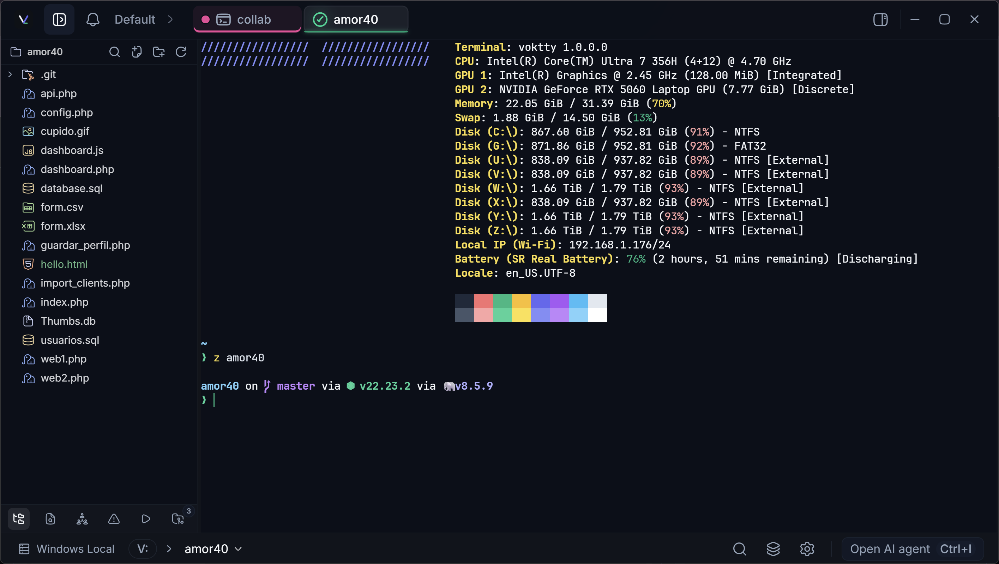

# Documentation images

This directory contains the official Voktty screenshots used by the README, architecture documentation, and screenshot gallery.

The images are documentation assets. They are not part of the application runtime and are not loaded during normal Voktty use. The maintained gallery is in [screenshots.md](../screenshots.md), and the main README links to these files with relative paths that work on GitHub and in local clones.

## Conventions

- Keep PNG files in this directory and use stable, descriptive names for new captures.
- Do not include keys, tokens, private paths, sensitive addresses, or personal data in a capture.
- Add descriptive alt text and update [screenshots.md](../screenshots.md) whenever the official gallery changes.
- Use these images only for documentation. Runtime visual resources belong in `public/` or in the relevant module.

## Use from Markdown

From a README in the repository root:

```md

```

From a document inside `docs/`:

```md

```

From a translated README inside `docs/readme/`:

```md

```
