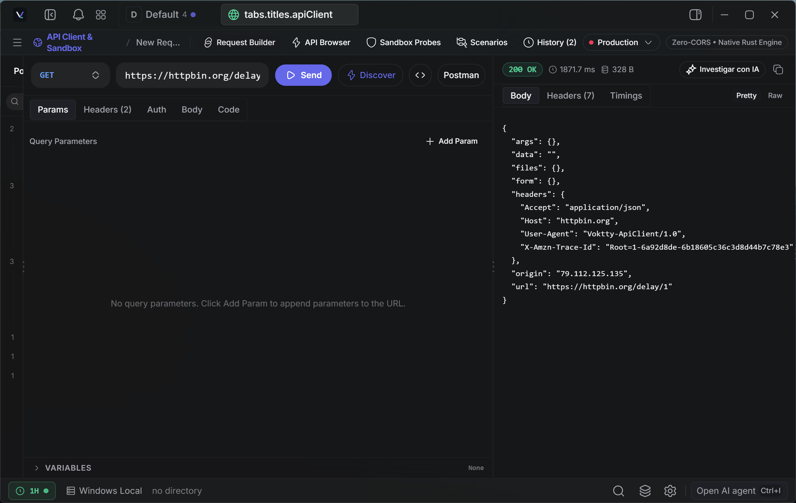
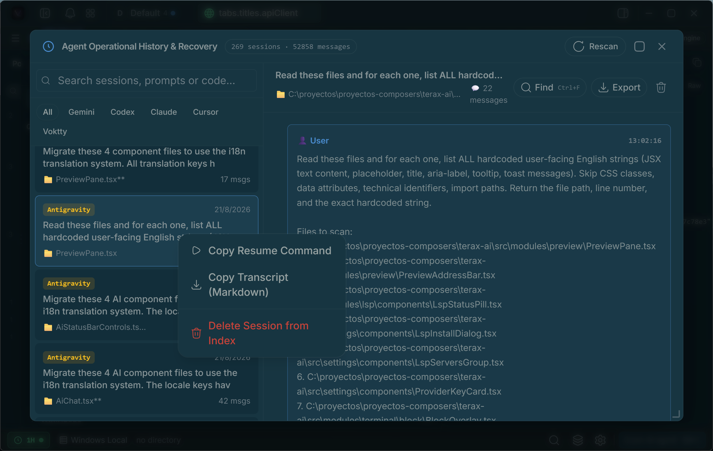
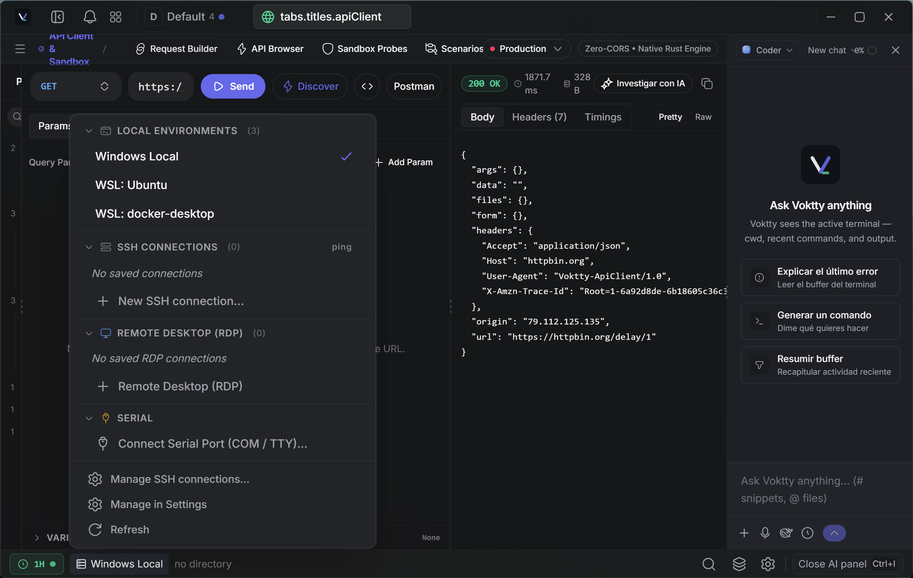
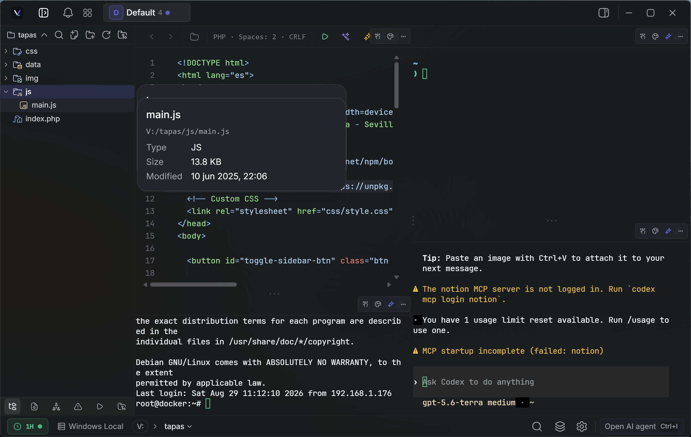
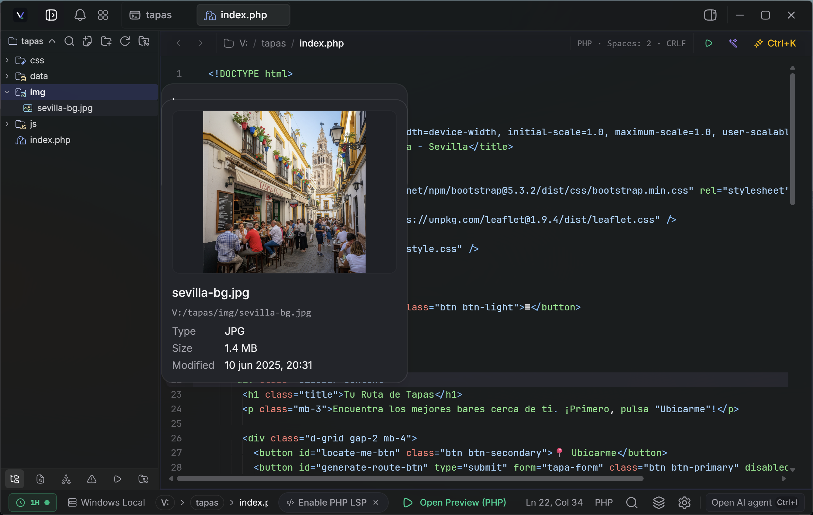

<div align="center">
  
  <h1>Voktty</h1>
  <p><strong>हल्का, टर्मिनल-केंद्रित और AI-नेटिव डेवलपमेंट वर्कस्पेस।</strong></p>
  <p><a href="https://voktty.dev">वेबसाइट</a> · <a href="https://voktty.dev/docs">दस्तावेज़</a> · <a href="https://github.com/voktty/voktty">वेबसाइट का सोर्स कोड</a></p>

  <p>
    
    
    
    <a href="https://discord.gg/z8mzebCzJB"></a>

  </p>
</div>

<p align="center">
  <a href="../../README.md">English</a> | <a href="README.zh-CN.md">简体中文</a> | <a href="README.es.md">Español</a> | <a href="README.de.md">Deutsch</a> | <a href="README.fr.md">Français</a> | <a href="README.ja.md">日本語</a> | <a href="README.ko.md">한국어</a> | <a href="README.pt-BR.md">Português</a> | <a href="README.pl.md">Polski</a> | <a href="README.ru.md">Русский</a> | <a href="README.id.md">Bahasa Indonesia</a>
</p>

---

Voktty एक हल्का, ओपन-सोर्स, टर्मिनल-केंद्रित और AI-नेटिव डेवलपमेंट एनवायरनमेंट (ADE) है, जिसे Tauri 2 + Rust और React 19 पर बनाया गया है। इसमें WebGL रेंडरर वाला नेटिव PTY बैकएंड, आपकी अपनी कुंजियों या पूरी तरह स्थानीय मॉडल पर चलने वाला एजेंटिक AI साइड पैनल, कोड एडिटर, फ़ाइल एक्सप्लोरर, Git ग्राफ़ के साथ सोर्स कंट्रोल और वेब प्रीव्यू पैनल शामिल हैं। डिस्क पर लगभग 7-8 MB। कोई टेलीमेट्री नहीं। कोई खाता नहीं।

## स्क्रीनशॉट

<table>
  <tr><td align="center"><br/><sub>रिक्वेस्ट बिल्डर और रिस्पॉन्स निरीक्षण वाला API क्लाइंट और सैंडबॉक्स</sub></td><td align="center"><br/><sub>खोज योग्य सेशन और ट्रांसक्रिप्ट के साथ एजेंट हिस्ट्री और रिकवरी</sub></td></tr>
  <tr><td align="center"><br/><sub>लोकल, WSL, SSH, RDP और सीरियल एनवायरनमेंट का चयन</sub></td><td align="center"><br/><sub>कोड एडिटर, टर्मिनल, AI पैनल और होवर पर फ़ाइल जानकारी</sub></td></tr>
  <tr><td colspan="2" align="center"><br/><sub>एक्सप्लोरर से दिखाई गई इमेज प्रीव्यू और फ़ाइल मेटाडेटा</sub></td></tr>
</table>

## सुविधाएँ

### टर्मिनल

- WebGL रेंडरर, मल्टी-टैब और बैकग्राउंड स्ट्रीमिंग के साथ xterm.js
- एडिटर जैसे कमांड इनपुट वाला GPU-त्वरित ब्लॉक-आधारित टर्मिनल
- `portable-pty` के माध्यम से नेटिव PTY बैकएंड (zsh, bash, pwsh, fish, cmd)
- क्षैतिज और लंबवत स्प्लिट पैनल
- इनलाइन खोज, लिंक पहचान और ट्रू कलर
- एक्सप्लोरर या डेस्कटॉप से फ़ाइलों को शेल-सुरक्षित उद्धृत पाथ के रूप में टर्मिनल में खींचें
- Windows पर प्रति-टैब वर्कस्पेस एनवायरनमेंट (Local या कोई स्थापित WSL डिस्ट्रो)
- Spaces अगली बार शुरू होने पर टैब, कार्य निर्देशिका और स्प्लिट लेआउट पुनर्स्थापित करता है

### कोड एडिटर

- CodeMirror 6, जो TS/JS, Rust, Python, Go, C/C++, Java, HTML/CSS, JSON और Markdown जैसी लोकप्रिय भाषाओं का समर्थन करता है
- स्थानीय मॉडल समर्थन के साथ इनलाइन AI ऑटोकम्प्लीट
- AI एडिट डिफ़, जिन्हें हर हंक पर स्वीकार या अस्वीकार किया जा सकता है
- डायग्नोस्टिक्स, नेविगेशन, कम्प्लीशन, फ़ॉर्मेटिंग और कस्टम सर्वर के साथ वैकल्पिक लैंग्वेज सर्वर समर्थन
- रेंडर्ड Markdown और इमेज, वीडियो, ऑडियो तथा PDF देखना
- Vim मोड
- Kanagawa, Catppuccin, Rosé Pine, Everforest, Dracula, Solarized, Nord, Tokyo Night, GitHub और Xcode सहित बिल्ट-इन थीम

### सोर्स कंट्रोल

- हंक को stage / unstage करें, commit (Cmd+Enter / Ctrl+Enter) करें और upstream की जानकारी के साथ push करें
- detached HEAD स्थिति सहित ब्रांच प्रदर्शन
- मर्ज और ब्रांच के लिए लेन वाले वास्तविक commit ग्राफ़ के साथ Git इतिहास
- commit खोजें और फ़िल्टर करें, फिर remote commit पेज खोलें

### फ़ाइल एक्सप्लोरर

- Catppuccin आइकन थीम
- फ़ज़ी खोज, कीबोर्ड नेविगेशन, इनलाइन नाम बदलना और संदर्भ क्रियाएँ
- डिस्क पर फ़ाइल बदलने पर लाइव अपडेट
- फ़ाइलों और चयन को सीधे AI साइड पैनल में संलग्न करें

### वेब प्रीव्यू

- स्थानीय डेवलपमेंट सर्वर अपने आप पहचानकर प्रीव्यू टैब में खोलता है
- नेटिव चाइल्ड WebView के माध्यम से बाहरी URL का प्रीव्यू

### थीम और कस्टमाइज़ेशन

- ऐप में कस्टम थीम बनाएँ और बिल्ट-इन प्रीसेट तथा अपनी थीम के बीच बदलें
- थीम साझा करें या समुदाय से आयात करें
- समायोज्य अपारदर्शिता और ब्लर वाली बैकग्राउंड इमेज
- एडिटर थीम ऐप थीम से स्वतंत्र है

### AI

- **अपनी कुंजी वाले प्रदाता:** OpenAI, Anthropic, Google (Gemini), Groq, xAI (Grok), Cerebras, OpenRouter, DeepSeek, Mistral और कोई भी OpenAI-संगत endpoint
- **स्थानीय / ऑफ़लाइन:** LM Studio, MLX, Ollama
- **एजेंटिक वर्कफ़्लो:** योजनाएँ, सब-एजेंट, `VOKTTY.md` के माध्यम से प्रोजेक्ट मेमोरी, फ़ाइल पढ़ना / लिखना / एडिट / मल्टी-एडिट / grep / glob, अनुमोदन वाला bash और बैकग्राउंड प्रोसेस
- **कोडिंग एजेंट ऑर्केस्ट्रेशन:** टर्मिनल में Claude Code शुरू करें, उसका आउटपुट देखें और अनुमोदन वाले टूल से अगला काम भेजें
- **कम्पोज़र:** `#handle` से प्रॉम्प्ट स्निपेट, `@path` से फ़ाइलें, वॉइस इनपुट और एक्सप्लोरर या चयन से अटैचमेंट
- अपने सिस्टम प्रॉम्प्ट और टूल सबसेट वाले **कस्टम एजेंट**
- **प्लान मोड**, जो कार्य से पहले योजना बनाता है और पुष्टि माँगता है

## Voktty की वर्तमान नई सुविधाएँ

- **फ्लैट संयुक्त Spaces:** स्वतंत्र टैब नाम वाले Spaces से अलग रहते हैं। सदस्यों को निश्चित क्रम में पुनर्व्यवस्थित किया जा सकता है; 2, 4, 6 या 8 दृश्य उपलब्ध हैं और Spaces को नेस्ट नहीं किया जा सकता।
- **IDE और डिबगिंग:** CodeMirror 6, प्रतीक नेविगेशन, Problems पैनल, कोड कार्रवाइयाँ, Ghost completion, समीक्षा योग्य diff बदलाव और संगत adapter कॉन्फ़िगर होने पर DAP डिबगिंग।
- **सुरक्षित MCP क्लाइंट:** स्थानीय stdio सर्वर या दूरस्थ Streamable HTTP सर्वर से कनेक्ट करें। टूल सत्यापित होते हैं और बदलावों के लिए native एक-बार अनुमति चाहिए।
- **Native extensions:** `~/.voktty/extensions/` की JavaScript extensions कमांड, शॉर्टकट, AI टूल, सूचनाएँ और workspace कार्रवाइयाँ जोड़ सकती हैं। यह Voktty API है, VS Code extension compatibility layer नहीं।
- **टर्मिनल सहयोग:** observer और controller भूमिकाओं, अतिरिक्त encryption और केवल-पढ़ने योग्य दूरस्थ फ़ाइल citations के साथ अस्थायी टर्मिनल साझा करें।
- **कनेक्शन और प्रदर्शन:** Local, WSL, SSH, Docker और serial वातावरण connection lifecycle दिखाते हैं; छिपे हुए टर्मिनल सक्रिय प्रक्रियाओं को रोके बिना महँगे renderers मुक्त करते हैं।
- **Agent presence:** भूमिका-आधारित avatars, बाहरी agents के animated icons और save, Git, Problems, debugging तथा agent responses के लिए वैकल्पिक स्थानीय sounds, reduced motion समर्थन के साथ।

सुरक्षा सीमाओं और प्लेटफ़ॉर्म उपलब्धता सहित पूरी canonical feature सूची [अंग्रेज़ी README](../../README.md) में है।

## इंस्टॉल करें

नवीनतम इंस्टॉलर [Releases](https://github.com/voktty/voktty/releases/latest) पेज पर हैं। Voktty वहीं से अपने आप अपडेट होता है।

### Windows नोट्स

- डिफ़ॉल्ट शेल पहचान: `pwsh.exe` (PowerShell 7+) -> `powershell.exe` (Windows PowerShell 5.1) -> `cmd.exe`।
- WSL एक पूर्ण वर्कस्पेस एनवायरनमेंट है, केवल लिपटा हुआ सबप्रोसेस नहीं।

### Linux नोट्स

- **Arch / AUR:** `yay -S voktty-bin` या `paru`। यह नवीनतम रिलीज़ का अनुसरण करता है।
- **NixOS / Nix:** आधिकारिक flake का उपयोग करें। NixOS के बाहर `nix profile install github:voktty/voktty` चलाएँ। NixOS में flake आयात करें और `inputs.voktty.packages.${pkgs.system}.voktty` को `environment.systemPackages` में जोड़ें। आसान सेटअप के लिए `nixosModules.voktty` भी उपलब्ध है।
- **AppImage:** FUSE आवश्यक है। इसके बिना `./Voktty_*.AppImage --appimage-extract-and-run` चलाएँ। Wayland पर रेंडरिंग समस्या हो तो `WEBKIT_DISABLE_DMABUF_RENDERER=1` आज़माएँ। `.deb` / `.rpm` पैकेज सिस्टम GTK स्टैक से जुड़ते हैं और आम तौर पर अधिक सुचारु चलते हैं।

## AI कॉन्फ़िगर करें

1. **सेटिंग्स -> AI** खोलें।
2. प्रदाता चुनें और API कुंजी पेस्ट करें। स्थानीय इन्फ़रेंस के लिए Voktty को LM Studio / MLX / Ollama endpoint पर निर्देशित करें।
3. कुंजियाँ `keyring` के माध्यम से OS कीचेन में लिखी जाती हैं। वे कभी भी डिस्क या localStorage में नहीं लिखी जातीं।

## सोर्स से बिल्ड करें

**आवश्यकताएँ**

- Rust (stable), https://rustup.rs
- Node 20+ और [pnpm](https://pnpm.io)
- आपके प्लेटफ़ॉर्म के लिए Tauri आवश्यकताएँ, https://tauri.app/start/prerequisites/

**चलाएँ**

```bash
pnpm install
pnpm tauri dev          # डेवलपमेंट
pnpm tauri build        # प्रोडक्शन बंडल
```

**जाँच**

```bash
pnpm lint
pnpm check-types
pnpm test
cd src-tauri && cargo clippy --all-targets --locked -- -D warnings   # CI के समान Rust lint
cd src-tauri && cargo nextest run --locked                           # या cargo test --locked
```

## टेक स्टैक

Tauri 2, Rust, `portable-pty`, React 19, TypeScript, Vite, xterm.js, CodeMirror 6, Vercel AI SDK v6, Tailwind v4, shadcn/ui और Zustand।

## योगदान

Issues और PR का स्वागत है। समस्याएँ रिपोर्ट करें, सुविधाएँ सुझाएँ या pull request भेजें। अधिक जानकारी के लिए [CONTRIBUTING.md](https://github.com/voktty/voktty/blob/main/CONTRIBUTING.md) और [आर्किटेक्चर दस्तावेज़](../README.md) देखें।

## प्लेटफ़ॉर्म साइनिंग की स्थिति

वर्तमान प्रीव्यू बिल्ड Windows और macOS के लिए ऑपरेटिंग सिस्टम कोड साइनिंग और नोटराइज़ेशन के बिना बनाए जाते हैं। Windows SmartScreen और macOS Gatekeeper चेतावनी दिखा सकते हैं, क्योंकि इंस्टॉलर और ऐप पैकेज अभी इन प्लेटफ़ॉर्म पर विश्वसनीय के रूप में पहचाने नहीं जाते।

ये चेतावनियाँ अपने आप में मैलवेयर का प्रमाण नहीं हैं, लेकिन केवल Voktty के आधिकारिक रिलीज़ चैनलों से डाउनलोड किए गए बिल्ड को checksum या रिलीज़ सिग्नेचर सत्यापित करने के बाद इंस्टॉल करें। Voktty updater सिग्नेचर ऑपरेटिंग सिस्टम कोड साइनिंग से अलग है और संबंधित रिलीज़ कुंजी कॉन्फ़िगर होने पर ही अपडेट की प्रामाणिकता की रक्षा करता है।

स्थिर वितरण से पहले प्लेटफ़ॉर्म प्रमाणपत्र और नोटराइज़ेशन जोड़े जाएंगे।

<br clear="left" />

## लाइसेंस

Voktty Apache-2.0 लाइसेंस के अंतर्गत है। निर्भरताओं की जानकारी के लिए [Apache License 2.0](https://github.com/voktty/voktty/blob/main/LICENSE) देखें।
