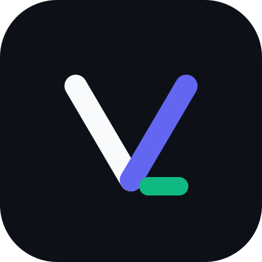
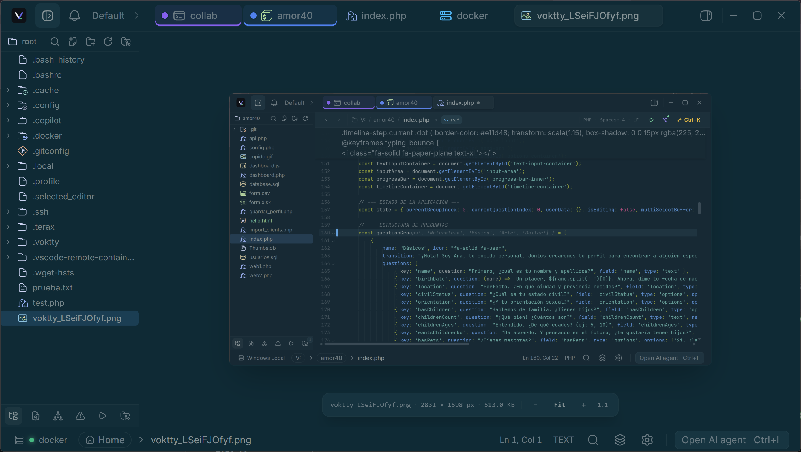
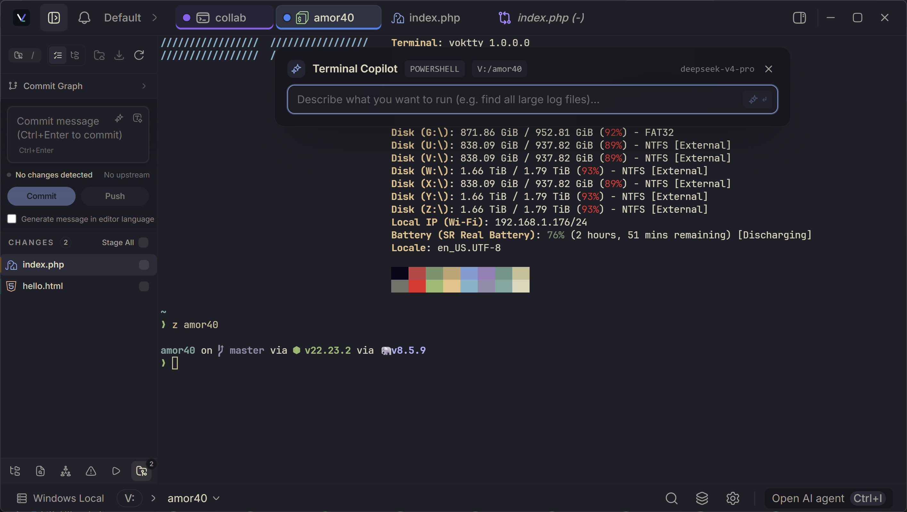
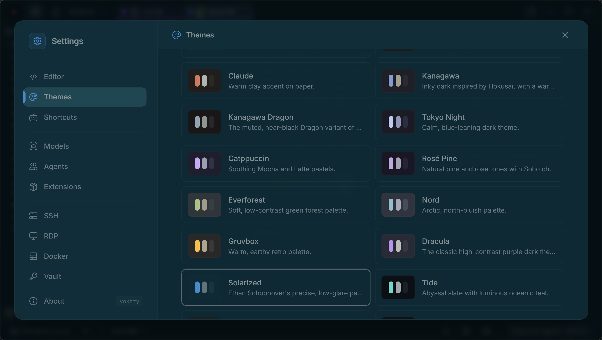
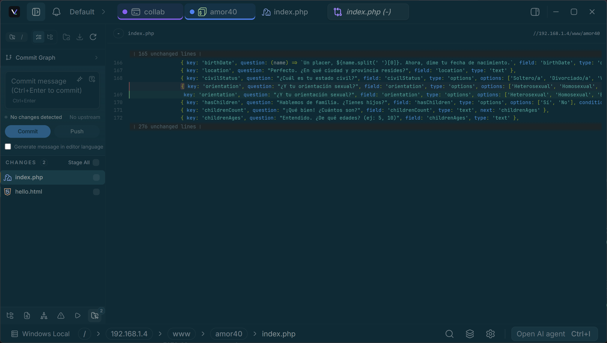

<div align="center">
  
  <h1>Voktty</h1>
  <p><strong>Workspace de desenvolvimento leve, focado no terminal e nativo de IA.</strong></p>
  <p><a href="https://voktty.dev">Site</a> · <a href="https://voktty.dev/docs">Documentação</a> · <a href="https://github.com/voktty/voktty">Código-fonte do site</a></p>

  <p>
    
    
    
    <a href="https://discord.gg/z8mzebCzJB"></a>

  </p>
</div>

<p align="center">
  <a href="../../README.md">English</a> | <a href="README.zh-CN.md">简体中文</a> | <a href="README.es.md">Español</a> | <a href="README.de.md">Deutsch</a> | <a href="README.fr.md">Français</a> | <a href="README.ja.md">日本語</a> | <a href="README.ko.md">한국어</a> | <a href="README.pl.md">Polski</a> | <a href="README.ru.md">Русский</a> | <a href="README.id.md">Bahasa Indonesia</a> | <a href="README.hi.md">हिन्दी</a>
</p>

---

Voktty é um ambiente de desenvolvimento (ADE) leve, de código aberto, focado no terminal e nativo de IA, criado com Tauri 2 + Rust e React 19. Inclui backend PTY nativo com renderizador WebGL, painel lateral de IA com agentes que usa suas próprias chaves ou modelos totalmente locais, além de editor de código, explorador de arquivos, controle de versão com gráfico Git e painel de visualização web. Cerca de 7-8 MB em disco. Sem telemetria. Sem conta.

## Capturas de tela

<table>
  <tr><td align="center"><br/><sub>Workspace do Voktty com arquivos e abas</sub></td><td align="center"><br/><sub>Copilot do terminal com linguagem natural</sub></td></tr>
  <tr><td align="center"><br/><sub>Temas personalizados e predefinições</sub></td><td align="center"><br/><sub>Painel de controle de versão com gráfico Git</sub></td></tr>
  <tr><td colspan="2" align="center"><br/><sub>Terminal com informações do sistema e explorador de arquivos</sub></td></tr>
</table>

## Recursos

### Terminal

- xterm.js com renderizador WebGL, várias abas e transmissão em segundo plano
- Terminal baseado em blocos e acelerado por GPU com entrada semelhante a um editor
- Backend PTY nativo via `portable-pty` (zsh, bash, pwsh, fish, cmd)
- Painéis divididos na horizontal e vertical
- Busca integrada, detecção de links e cores reais
- Arraste arquivos do explorador ou desktop como caminhos com escape seguro para o shell
- Ambientes por aba no Windows (Local ou qualquer distribuição WSL instalada)
- Spaces restaura abas, diretórios e layouts divididos entre inicializações

### Editor de código

- CodeMirror 6, compatível com linguagens populares como TS/JS, Rust, Python, Go, C/C++, Java, HTML/CSS, JSON e Markdown
- Autocompletar por IA com suporte a modelos locais
- Diffs de edição por IA aceitos ou rejeitados bloco por bloco
- Servidores de linguagem opcionais com diagnósticos, navegação, conclusão, formatação e servidores personalizados
- Markdown renderizado e visualização de imagens, vídeos, áudio e PDF
- Modo Vim
- Temas integrados como Kanagawa, Catppuccin, Rosé Pine, Everforest, Dracula, Solarized, Nord, Tokyo Night, GitHub e Xcode

### Controle de versão

- Adicionar ou remover blocos do stage, fazer commit (Cmd+Enter / Ctrl+Enter) e push com reconhecimento do upstream
- Exibição de branches, incluindo HEAD destacado
- Histórico Git com gráfico real de commits e trilhas para merges e branches
- Busca e filtro de commits com acesso à página remota do commit

### Explorador de arquivos

- Tema de ícones Catppuccin
- Busca aproximada, navegação por teclado, renomeação integrada e ações de contexto
- Atualizações ao vivo quando arquivos mudam no disco
- Anexe arquivos e seleções diretamente ao painel de IA

### Visualização web

- Detecta servidores locais e os abre em uma aba de visualização
- Visualiza URLs externas por uma webview filha nativa

### Temas e personalização

- Crie temas no aplicativo e alterne entre predefinições e temas próprios
- Compartilhe temas ou importe-os da comunidade
- Imagens de fundo com opacidade e desfoque ajustáveis
- O tema do editor é independente do tema do aplicativo

### IA

- **Provedores com sua própria chave:** OpenAI, Anthropic, Google (Gemini), Groq, xAI (Grok), Cerebras, OpenRouter, DeepSeek, Mistral e qualquer endpoint compatível com OpenAI
- **Local / offline:** LM Studio, MLX, Ollama
- **Fluxo com agentes:** planos, subagentes, memória do projeto via `VOKTTY.md`, leitura / escrita / edição / multiedição / grep / glob, bash com aprovação e processos em segundo plano
- **Orquestração de agentes de programação:** inicie Claude Code no terminal, inspecione a saída e envie tarefas adicionais por ferramentas sujeitas a aprovação
- **Compositor:** trechos de prompt com `#handle`, arquivos com `@path`, entrada de voz e anexos do explorador ou da seleção
- **Agentes personalizados** com prompt de sistema e subconjunto de ferramentas próprios
- **Modo de planejamento** que gera um plano e pede confirmação antes de agir

## Novidades atuais do Voktty

- **Spaces compostos planos:** abas avulsas ficam separadas dos Spaces nomeados. Os membros podem ser reordenados de forma determinística, com 2, 4, 6 ou 8 vistas e sem Spaces aninhados.
- **IDE e depuração:** CodeMirror 6, navegação de símbolos, painel Problems, ações de código, ghost completion, alterações revisáveis por diff e depuração DAP quando um adaptador compatível está configurado.
- **Cliente MCP seguro:** conecte servidores locais por stdio ou servidores remotos por Streamable HTTP. As ferramentas são validadas e mutações exigem uma aprovação nativa de uso único.
- **Extensões nativas:** extensões JavaScript em `~/.voktty/extensions/` podem adicionar comandos, atalhos, ferramentas de IA, notificações e ações do workspace. Esta é uma API própria do Voktty, não compatibilidade com extensões do VS Code.
- **Colaboração no terminal:** compartilhe temporariamente um terminal com funções de observador e controlador, criptografia adicional e citações remotas de arquivos somente leitura.
- **Conexões e desempenho:** ambientes Local, WSL, SSH, Docker e serial exibem o ciclo de conexão; terminais ocultos liberam renderizadores pesados sem interromper processos ativos.
- **Presença dos agentes:** avatares por função, ícones animados para agentes externos e sons locais opcionais para salvamentos, Git, Problems, depuração e respostas dos agentes, com suporte a movimento reduzido.

A lista completa e canônica de recursos está no [README em inglês](../../README.md), incluindo limites de segurança e disponibilidade por plataforma.

## Instalação

Os instaladores mais recentes estão na página de [Releases](https://github.com/voktty/voktty/releases/latest). O Voktty se atualiza automaticamente por ela.

### Notas para Windows

- Detecção de shell: `pwsh.exe` (PowerShell 7+) -> `powershell.exe` (Windows PowerShell 5.1) -> `cmd.exe`.
- WSL é um ambiente de workspace de primeira classe, não um subprocesso encapsulado.

### Notas para Linux

- **Arch / AUR:** `yay -S voktty-bin` ou `paru`. Acompanha a versão mais recente.
- **NixOS / Nix:** use o flake oficial com `nix profile install github:voktty/voktty` fora do NixOS. No NixOS, importe o flake e adicione `inputs.voktty.packages.${pkgs.system}.voktty` a `environment.systemPackages`. `nixosModules.voktty` também oferece uma configuração simplificada.
- **AppImage:** requer FUSE. Sem ele: `./Voktty_*.AppImage --appimage-extract-and-run`. Em caso de falhas no Wayland, tente `WEBKIT_DISABLE_DMABUF_RENDERER=1`. Os pacotes `.deb` / `.rpm` usam a pilha GTK do sistema e costumam ser mais suaves.

## Configurar a IA

1. Abra **Configurações -> IA**.
2. Escolha um provedor e cole sua chave de API. Para inferência local, indique o endpoint do LM Studio / MLX / Ollama.
3. As chaves são gravadas no chaveiro do sistema via `keyring`. Nunca são gravadas no disco nem no localStorage.

## Compilar do código-fonte

**Pré-requisitos**

- Rust (stable), https://rustup.rs
- Node 20+ e [pnpm](https://pnpm.io)
- Pré-requisitos do Tauri para sua plataforma, https://tauri.app/start/prerequisites/

**Executar**

```bash
pnpm install
pnpm tauri dev          # desenvolvimento
pnpm tauri build        # pacote de produção
```

**Verificações**

```bash
pnpm lint
pnpm check-types
pnpm test
cd src-tauri && cargo clippy --all-targets --locked -- -D warnings   # lint Rust igual ao CI
cd src-tauri && cargo nextest run --locked                           # ou: cargo test --locked
```

## Tecnologias

Tauri 2, Rust, `portable-pty`, React 19, TypeScript, Vite, xterm.js, CodeMirror 6, Vercel AI SDK v6, Tailwind v4, shadcn/ui e Zustand.

## Como contribuir

Issues e PRs são bem-vindos. Relate problemas, sugira recursos ou envie pull requests. Consulte [CONTRIBUTING.md](https://github.com/voktty/voktty/blob/main/CONTRIBUTING.md) e a [documentação de arquitetura](../README.md).

## Status da assinatura das plataformas

As builds preliminares atuais são geradas sem assinatura de código do sistema operacional nem notarização para Windows e macOS. O Windows SmartScreen e o macOS Gatekeeper podem mostrar avisos porque os instaladores e pacotes do aplicativo ainda não são reconhecidos como confiáveis por essas plataformas.

Esses avisos, por si só, não provam a existência de malware, mas instale apenas uma build baixada dos canais oficiais do Voktty depois de verificar seu checksum ou sua assinatura de release. A assinatura do atualizador do Voktty é independente da assinatura do sistema operacional e protege a autenticidade das atualizações somente quando a chave de release correspondente está configurada.

Os certificados das plataformas e a notarização serão adicionados antes da distribuição estável.

<br clear="left" />

## Licença

Voktty é licenciado sob a Apache-2.0. Para informações sobre dependências, consulte a [Apache License 2.0](https://github.com/voktty/voktty/blob/main/LICENSE).
